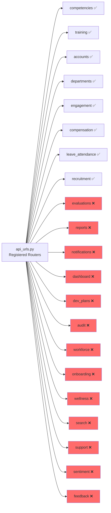

# Q360 Sistem Audit Hesabatı — Hərtərəfli Analiz

> **Tarix:** 2026-07-07 | **Analitik Rollar:** Baş Sistem Analitiki, Məhsul Meneceri, Layihə Memarı
> **Layihə:** Q360 — Dövlət Sektoru üçün 360° Qiymətləndirmə Platforması
> **Texnologiya:** Django 5.1 + DRF + PostgreSQL 16 + Redis + Celery + Docker

---

## 1. İcraçı Xülasə (Executive Summary)

Q360 layihəsi 22 Django tətbiqindən (app), 180+ HTML şablondan, tam Docker infrastrukturundan və çox-kanallı bildiriş sistemindən ibarət genişmiqyaslı HR qiymətləndirmə platformasıdır. **Əsas 360° qiymətləndirmə nüvəsi (core)** yaxşı inkişaf etmişdir — kampaniya idarəetməsi, sual bankı, çəkili bal hesablama, kalibrləmə və hesabat modulları funksional səviyyədədir. Lakin sistemin **əhatə dairəsi orijinal 360° qiymətləndirmədən kənara çıxaraq tam HRIS (İnsan Resursları İdarəetmə Sistemi) olmağa yönəlmişdir** — bu da əhəmiyyətli modul "yayılması" yaradıb: Recruitment, Compensation, Wellness, Leave/Attendance, Onboarding, Workforce Planning və s. kimi modullar model/view baxımından mövcuddur, lakin **inteqrasiya dərinliyi, test əhatəsi və edge-case idarəetməsi hələ natamamdır**. Ümumi tamamlanma dərəcəsi: **~68%** (core: ~82%, genişlənmə modulları: ~55%).

---

## 2. Tamamlanma Matrisi

### 2.1 Əsas (Core) Modullar

| Modul / Funksiya | Təsvir | Tamamlanma (%) | Status | Qeyd / Risk |
|---|---|---|---|---|
| **[accounts](file:///c:/Users/Tahmaz%20Muradov/Desktop/Q-360/q360_project/apps/accounts)** — İstifadəçi İdarəetməsi | User model, RBAC, MFA/2FA, JWT, profil, tərcümələr, middleware | 88% | ✅ Hazırlanır (WIP) | 20 fayl, 668 sətir model. `rbac.py` (10K), `template_views.py` (45K). 2FA tam implementasiyalıdır. **Risk:** Session hijacking testi yoxdur; `security_utils.py` funksiyaları test olunmayıb |
| **[evaluations](file:///c:/Users/Tahmaz%20Muradov/Desktop/Q-360/q360_project/apps/evaluations)** — 360° Qiymətləndirmə | Kampaniya, sual bankı, tapşırıq, cavab, nəticə, kalibrləmə | 85% | ✅ Hazırlanır (WIP) | 744 sətir model, çəkili bal hesablama düzgündür. Kalibrləmə modulu mövcuddur. **Risk:** Kampaniya "mid-flight edit" ssenariləri idarə olunmur; batch assignment performansı test olunmayıb |
| **[departments](file:///c:/Users/Tahmaz%20Muradov/Desktop/Q-360/q360_project/apps/departments)** — Təşkilat Strukturu | Organization, Department (MPTT), Position | 82% | ✅ Hazırlanır (WIP) | MPTT iyerarxik struktur yaxşıdır. 5 template. **Risk:** `serializers.py` (4K) mövcud, amma department birləşmə/ayırma (merge/split) ssenariləri yoxdur |
| **[reports](file:///c:/Users/Tahmaz%20Muradov/Desktop/Q-360/q360_project/apps/reports)** — Hesabatlar | Report, RadarChart, ReportGenerationLog, ScheduledReport, CustomReportBlueprint, SystemKPI | 78% | ✅ Hazırlanır (WIP) | 779 sətir model, 13 template, Celery tasks mövcud. PDF/Excel export `utils.py`-da (13K). **Risk:** Custom Report Builder kodu böyükdür (33K template) — performans və güvenlik testi lazımdır |
| **[notifications](file:///c:/Users/Tahmaz%20Muradov/Desktop/Q-360/q360_project/apps/notifications)** — Bildiriş Sistemi | Multi-channel (Email, SMS, Push, In-app), WebSocket, templates, scheduling | 80% | ✅ Hazırlanır (WIP) | 823 sətir model, 21 template, real-time WebSocket (`consumers.py`). **Risk:** SMS provider (`sms_utils.py`) gerçək API ilə test olunmayıb; Push bildirişlər `push_utils.py` mövcud amma inteqrasiya yoxdur |
| **[audit](file:///c:/Users/Tahmaz%20Muradov/Desktop/Q-360/q360_project/apps/audit)** — Audit & Təhlükəsizlik | AuditLog, full-text search, threat level scoring, security dashboard | 75% | ✅ Hazırlanır (WIP) | Threat scoring alqoritmi yaxşıdır. 2 template. **Risk:** Audit log rotation/archival siyasəti yoxdur; böyük həcmli log-larda performans problemi yarana bilər |
| **[development_plans](file:///c:/Users/Tahmaz%20Muradov/Desktop/Q-360/q360_project/apps/development_plans)** — İnkişaf Planları & OKR | DevelopmentGoal, GoalProgress, OKR (Objective, KeyResult) | 78% | ✅ Hazırlanır (WIP) | İki ayrı model faylı (models.py + models_okr.py = 36K). 15 template. **Risk:** OKR və qiymətləndirmə nəticələri arasında avtomatik bağlantı yoxdur |
| **[competencies](file:///c:/Users/Tahmaz%20Muradov/Desktop/Q-360/q360_project/apps/competencies)** — Kompetensiya Bankı | Competency, ProficiencyLevel, PositionCompetency, UserSkill | 72% | ✅ Hazırlanır (WIP) | 11K model, API (serializers + views) tam. 4 template. **Risk:** Skill gap analysis hesablama məntiqi view-da, service layer yoxdur |
| **[dashboard](file:///c:/Users/Tahmaz%20Muradov/Desktop/Q-360/q360_project/apps/dashboard)** — Dashboard & Analitika | AI forecasting, KPI dashboard, trend analysis, real-time stats | 65% | 🔄 Hazırlanır (WIP) | `ai_forecasting.py` (14K), `views.py` (31K). 5 template. **Risk:** AI forecasting mock dataya əsaslanır — real model inteqrasiyası yoxdur; `export_views.py` (14K) Excel export kodu mövcud |

### 2.2 Genişlənmə (HRIS) Modulları

| Modul / Funksiya | Təsvir | Tamamlanma (%) | Status | Qeyd / Risk |
|---|---|---|---|---|
| **[training](file:///c:/Users/Tahmaz%20Muradov/Desktop/Q-360/q360_project/apps/training)** — Təlim İdarəetməsi | TrainingResource, UserTraining, LMS inteqrasiya, Skill Matrix, Sertifikatlar | 72% | 🔄 Hazırlanır (WIP) | 19K model, `lms_integration.py` (15K) və `elearning_integration.py` (18K) mövcud. 6 template. **Risk:** LMS inteqrasiya konkret API ilə test edilməyib; `skill_matrix.py` hesablama məntiqi böyükdür |
| **[continuous_feedback](file:///c:/Users/Tahmaz%20Muradov/Desktop/Q-360/q360_project/apps/continuous_feedback)** — Davamlı Geri Bildirim | Feedback, Recognition, Analytics, Proactive Suggestions | 70% | 🔄 Hazırlanır (WIP) | 13K model, `analytics.py` (14K). 8 template. Test əhatəsi yaxşıdır (36K test). **Risk:** `proactive_suggestions` AI logikası test olunub amma production məlumatla yoxlanılmayıb |
| **[recruitment](file:///c:/Users/Tahmaz%20Muradov/Desktop/Q-360/q360_project/apps/recruitment)** — İşə Qəbul (ATS) | JobPosting, Application, Interview, Offer, AI Screening, Video Interview | 62% | 🔄 Hazırlanır (WIP) | 28K model, `ai_screening.py` (27K), `video_interview.py` (18K). 11 template. **Risk:** AI screening kodu böyükdür — ML model inteqrasiyası stub ola bilər; video müsahibə WebRTC tələb edir, amma client-side implementasiya yoxlanılmayıb |
| **[compensation](file:///c:/Users/Tahmaz%20Muradov/Desktop/Q-360/q360_project/apps/compensation)** — Əmək Haqqı İdarəetməsi | SalaryInformation, EmployeeBenefit, Bonus, CompensationHistory, TotalRewards | 60% | 🔄 Hazırlanır (WIP) | 33K model, `total_rewards.py` (17K). 8 template. API views mövcud. **Risk:** Maaş məxfilik qaydaları (data masking) tam implementasiya olunmayıb; Benefit/Equity modeli yarımçıqdır |
| **[engagement](file:///c:/Users/Tahmaz%20Muradov/Desktop/Q-360/q360_project/apps/engagement)** — İşçi Bağlılığı | PulseSurvey, EngagementScore, Recognition, Gamification, Leaderboard | 60% | 🔄 Hazırlanır (WIP) | 16K model, full API (13K). 7 template. **Risk:** Gamification badge sistemi təyin olunub, amma ödül məntiqi (badge award triggers) tam işləmir; anonim feedback formu sadədir |
| **[leave_attendance](file:///c:/Users/Tahmaz%20Muradov/Desktop/Q-360/q360_project/apps/leave_attendance)** — Məzuniyyət & Davamiyyət | LeaveRequest, Attendance, LeaveBalance, LeaveType, Holiday | 58% | 🔄 Hazırlanır (WIP) | 14K model, API views (12K). 7 template. **Risk:** Davamiyyət-dən GPS/biometrik inteqrasiya yoxdur; məzuniyyət balans hesablama edge case-ləri (yarım gün, saatlıq) test olunmayıb |
| **[onboarding](file:///c:/Users/Tahmaz%20Muradov/Desktop/Q-360/q360_project/apps/onboarding)** — İşə Qəbul Prosesi | OnboardingTemplate, TaskTemplate, Process, Task (w/ automation) | 62% | 🔄 Hazırlanır (WIP) | 14K model, `services.py` (12K), signals mövcud. 7 template. **Risk:** Onboarding → Training → Compensation zəncir avtomatizasiyası services-də nəzərdə tutulub, amma tam end-to-end test yoxdur |
| **[wellness](file:///c:/Users/Tahmaz%20Muradov/Desktop/Q-360/q360_project/apps/wellness)** — Sağlamlıq & Rifah | HealthCheckup, MentalHealthSurvey, FitnessProgram, Challenge, MedicalClaim, StepTracking | 55% | 🔄 Hazırlanır (WIP) | 20K model (716 sətir), 15 template. **Risk:** Test faylı boşdur (`tests.py` = 60 bytes); sağlamlıq məlumatlarının məxfiliyi (HIPAA/GDPR analoqunu) tam tətbiq olunmayıb |
| **[workforce_planning](file:///c:/Users/Tahmaz%20Muradov/Desktop/Q-360/q360_project/apps/workforce_planning)** — İşçi Qüvvəsi Planlaması | TalentMatrix (9-Box), CriticalRole, SuccessionPlan, SkillGap | 52% | 🔄 Hazırlanır (WIP) | 12K model + `succession_models.py` (16K). 5 template. **Risk:** Test faylı boşdur; 9-Box matrix hesablama məntiqi sadədir — real data ilə validasiya lazımdır |
| **[sentiment_analysis](file:///c:/Users/Tahmaz%20Muradov/Desktop/Q-360/q360_project/apps/sentiment_analysis)** — Sentiment Analizi | SentimentFeedback, SentimentAnalysisSettings | 42% | 🔄 Dizayn mərhələsində | Model (69 sətir) və 2 template mövcud. VADER sentiment kullanılır. **Risk:** NLP modeli yalnız İngilis dili üçündür — Azərbaycan dili dəstəyi yoxdur; real-time analiz performansı naməlumdur |
| **[search](file:///c:/Users/Tahmaz%20Muradov/Desktop/Q-360/q360_project/apps/search)** — Axtarış Sistemi | Global search, PostgreSQL full-text | 40% | 🔄 Dizayn mərhələsində | `models.py` boşdur (yalnız placeholder). `search.py` (21K) mövcud, amma `views.py`-da (10K) implementasiya var. 1 template. **Risk:** Search index optimallaşdırılmayıb; auto-complete yoxdur |
| **[support](file:///c:/Users/Tahmaz%20Muradov/Desktop/Q-360/q360_project/apps/support)** — Dəstək / Help Desk | SupportTicket, TicketComment | 45% | 🔄 Dizayn mərhələsində | 2K model (94 sətir — çox sadə). 3 template. Test boşdur. **Risk:** Tiket kateqorizasiyası yoxdur; SLA tracking yoxdur; fayl əlavəsi dəstəklənmir |
| **[security](file:///c:/Users/Tahmaz%20Muradov/Desktop/Q-360/q360_project/apps/security)** — Təhlükəsizlik Utilities | Encryption, Audit Policy, Session Tracking | 55% | 🔄 Hazırlanır (WIP) | Yalnız utility moduludur (`crypto.py`, `audit_policy.py`, `session_tracking.py`). INSTALLED_APPS-da yoxdur. **Risk:** `crypto.py`-da encryption key management primitive-dir; session tracking middleware settings-də aktivləşdirilməyib |

### 2.3 İnfrastruktur & DevOps

| Komponent | Təsvir | Tamamlanma (%) | Status | Qeyd / Risk |
|---|---|---|---|---|
| **Docker & Docker Compose** | PostgreSQL, Redis, Web (Daphne ASGI), Celery Worker, Celery Beat, Nginx | 90% | ✅ Tamamlanıb | Healthcheck-lər tam. Volumes persist edir. **Risk:** Multi-stage build yoxdur; image ölçüsü optimallaşdırılmayıb |
| **Nginx** | Reverse proxy, static files, WebSocket proxy | 85% | ✅ Hazırlanır (WIP) | SSL/TLS sertifikat konfiqurasiyası placeholder-dır |
| **Celery & Celery Beat** | Async tasks, scheduled jobs | 80% | ✅ Hazırlanır (WIP) | `CELERY_BEAT_SCHEDULE`-da yalnız 1 task var. Xatırlatma/hesabat tasks-ları tam qeydiyyata alınmayıb |
| **PostgreSQL** | Database, encoding, timezone, connection pooling | 92% | ✅ Tamamlanıb | `CONN_MAX_AGE=600`, UTF8, indexes yaxşıdır |
| **Redis** | Cache, Celery broker, Channels layer | 88% | ✅ Tamamlanıb | maxmemory 256mb. AOF persistence aktiv |
| **Logging** | Multi-level, rotating file handlers, separate streams | 85% | ✅ Hazırlanır (WIP) | 8 ayrı log handler. JSON formatter mövcud, amma production-da istifadə olunmur |
| **Fixtures / Seed Data** | 9 fixture faylı | 80% | ✅ Hazırlanır (WIP) | Departments, accounts, competencies, evaluations, training, dev_plans, workforce, feedback, support |
| **Test Əhatəsi** | Unit tests across modules | 55% | 🔄 Hazırlanır (WIP) | 30 test faylı mövcud. 3 modul boş test-lərlə (`tests.py` = 60 bytes). Core modullar yaxşı əhatə olunub, HRIS modulları zəifdir |

---

## 3. Çatışmayan Elementlərin Siyahısı (Prioritetlər üzrə)

### 🔴 Yüksək Prioritet (Kritik) — Sistem işləməsi üçün mütləq lazımdır

| # | Çatışmayan Element | Modul | Təsir |
|---|---|---|---|
| 1 | **API Documentation (Swagger/ReDoc)** | config | API sənədləşdirilməyib. README-də endpoint-lər var, amma interaktiv Swagger/ReDoc yoxdur. Inteqrasiya edən tərəflər üçün kritikdir |
| 2 | **Evaluations API endpoint-ləri** | evaluations | `api_urls.py`-da evaluations üçün router qeydiyyatı yoxdur — yalnız template views var. REST API klienti evaluations ilə işləyə bilmir |
| 3 | **404/500 error səhifələri** | templates/errors | Yalnız 403 və 429 səhifələri var. 404 və 500 səhifələri çatışmır — istifadəçi generic Django error görəcək |
| 4 | **Data validation — kampaniya çəkiləri** | evaluations | Çəkilərin cəmi 100% olmalıdır — `clean()` metodu var, amma form-level validation UI-da istifadəçiyə göstərilmir |
| 5 | **Əsas modullar üçün boş testlər** | wellness, workforce_planning, support | 3 modulun test faylı yalnız `from django.test import TestCase` — heç bir test yoxdur |
| 6 | **Security middleware aktivləşdirmə** | security/config | `SessionTrackingMiddleware` `settings.py`-da middleware siyahısına əlavə olunmayıb; `security` app INSTALLED_APPS-da yoxdur |
| 7 | **Reports API endpoint-ləri** | reports/api | Reports üçün `api_urls.py`-da REST API router yoxdur — yalnız template views |
| 8 | **Notification API endpoint-ləri** | notifications/api | Notifications REST API `api_urls.py`-da qeydiyyat olunmayıb |
| 9 | **Dashboard API endpoint-ləri** | dashboard/api | Dashboard REST API `api_urls.py`-da qeydiyyat olunmayıb |

### 🟡 Orta Prioritet — UX və ya biznes logikası üçün vacibdir

| # | Çatışmayan Element | Modul | Təsir |
|---|---|---|---|
| 10 | **"Şifrəni Unutdum" axının tamamlanması** | accounts | Password reset template-ləri mövcuddur, amma email göndərmə Celery task olaraq qeydiyyata alınmayıb — sinxron işləyir |
| 11 | **User deletion/deactivation axını** | accounts | İstifadəçi silmə/deaktivləşdirmə UI-da tam dəstəklənmir. Admin panel-dən edilir, amma cascade təsirləri (evaluations, assignments) idarə olunmur |
| 12 | **Bulk import — CSV/Excel ilə istifadəçi idxalı** | accounts | İstifadəçilərin kütləvi yüklənməsi üçün endpoint/UI yoxdur — dövlət qurumlarında minlərlə əməkdaş olduğu üçün kritikdir |
| 13 | **Evaluation "peer nomination" axını** | evaluations | Həmkar seçimi yalnız admin tərəfindən edilir. İstifadəçinin öz həmkarlarını təklif etməsi mexanizmi yoxdur |
| 14 | **Evaluation deadline xatırlatmaları** | evaluations + notifications | Celery beat-da `deadline_reminder` task qeydiyyatı yoxdur — NotificationTemplate-da trigger mövcuddur, amma task yazılmayıb |
| 15 | **Department CRUD UI** | departments | Department yaratma/redaktə/silmə template-ləri yoxdur — yalnız view (chart + detail). Admin paneldən idarə olunur |
| 16 | **Report PDF/Excel download UI** | reports | `utils.py`-da generasiya kodu var, amma download button/flow template-lərdə tam inteqrasiya olunmayıb |
| 17 | **Multi-language dəstəyi — Azərbaycan dili tərcümələri** | locale | `locale/` qovluğu var, `.po` faylları yaradılıb, amma bir çox string hələ tərcümə olunmayıb. Sentiment analysis yalnız EN |
| 18 | **Engagement — gamification triggers** | engagement | Badge award məntiqi model-də təyin olunub, amma trigger signal-ları tam yazılmayıb |
| 19 | **Compensation — data masking** | compensation | Maaş məlumatları rol-əsaslı gizlədilməlidir (non-HR employee başqasının maaşını görməməlidir) — tam implementasiya yoxdur |
| 20 | **Leave — half-day/hourly leave** | leave_attendance | Model-də leave type-lar var, amma yarım gün və saatlıq məzuniyyət məntiqi yazılmayıb |
| 21 | **Onboarding ↔ Training ↔ Compensation chain** | onboarding | Services-də cross-module avtomatizasiya nəzərdə tutulub, amma tam zəncir test olunmayıb |
| 22 | **Profile photo upload/crop** | accounts | Profile photo yükləmə mövcuddur, amma crop/resize funksionallığı yoxdur |
| 23 | **Comparison Report** | reports | `comparison_report.html` (1.4K) və `comparison_select.html` (1.5K) template-ləri çox sadədir — yarımçıq görünür |
| 24 | **Notification Statistics/Delivery Logs** | notifications | `statistics.html` (1.3K) və `delivery_logs.html` (1.5K) minimal implementasiya — real data bind yoxdur |
| 25 | **Search — Autocomplete & Filters** | search | Global search mövcuddur, amma autocomplete dropdown, filter facets yoxdur |

### 🟢 Aşağı Prioritet — Gələcək inkişaf (v2.0) üçün tövsiyələr

| # | Çatışmayan Element | Modul | Təsir |
|---|---|---|---|
| 26 | **Mobile responsive audit** | UI/UX | Template-lər TailwindCSS ilə responsive-dir, amma mobile-first test edilməyib |
| 27 | **Dark mode dəstəyi** | UI/UX | Admin panel (Jazzmin) dark mode-dadır, amma frontend template-lərdə dark mode toggle yoxdur |
| 28 | **Activity feed / Timeline** | dashboard | İstifadəçinin son fəaliyyətlərinin timeline görünüşü yoxdur |
| 29 | **Export — təşkilat strukturu vizualizasiyası** | departments | Org chart PDF/PNG export funksionallığı yoxdur |
| 30 | **AI — Azərbaycan dili NLP** | sentiment_analysis | VADER yalnız İngilis dili dəstəkləyir. AZ dilində sentiment analiz üçün custom model lazımdır |
| 31 | **Webhooks / External integrations** | config | Xarici sistemlər üçün webhook callback mexanizmi yoxdur |
| 32 | **Performance benchmark / load testing** | DevOps | Load test script-ləri yoxdur (Locust, k6 və s.) |
| 33 | **CI/CD pipeline** | DevOps | GitHub Actions və ya GitLab CI konfiqurasiyası yoxdur |
| 34 | **Backup & Disaster Recovery** | DevOps | PostgreSQL backup script-ləri/cron yoxdur |
| 35 | **Data anonymization** | security | Demo/test mühiti üçün data anonymization script-i yoxdur |
| 36 | **Accessibility (a11y)** | UI/UX | WCAG 2.1 uyğunluğu test olunmayıb |
| 37 | **PWA / Offline Support** | UI/UX | Progressive Web App manifest/service worker yoxdur |
| 38 | **Multi-tenant dəstəyi** | accounts/departments | Hal-hazırda tək-tenant arxitekturadır. Çox-qurum dəstəyi mövcud deyil |
| 39 | **Audit log retention/archival** | audit | Köhnə audit log-ların arxivləşdirmə siyasəti yoxdur — DB şişməsi riski |
| 40 | **Video interview WebRTC client** | recruitment | Backend endpoint-ləri mövcuddur, amma frontend WebRTC client yazılmayıb |

---

## 4. Detallı Gap Analysis

### 4.1 Backend & API Boşluqları

> [!IMPORTANT]
> **22 moduldan yalnız 8-i REST API router-lərlə `api_urls.py`-da qeydiyyata alınıb.** Evaluations, reports, notifications, dashboard kimi əsas modulların REST API-ləri mövcud deyil — yalnız Django template views vasitəsilə əlçatandır. Bu, mobil tətbiq və ya SPA frontend inteqrasiyasını mümkünsüz edir.

### 4.2 UI/UX Boşluqları — İstifadəçi Axını (User Flow)

| User Flow | Mövcud Səhifələr | Çatışmayan Səhifələr/Komponentlər |
|---|---|---|
| **Login → Dashboard** | Login, 2FA verify, Dashboard | ❌ "Hesabı yoxdur" halı üçün admin əlaqə/bələdçi səhifəsi |
| **Kampaniya Yaratma** | campaign_form, campaign_detail, campaign_questions | ❌ Kampaniya wizard (çox addımlı form); ❌ Kampaniya klonlama |
| **Qiymətləndirmə Doldurma** | my_assignments, self_assessment, assignment_form | ❌ "Tamamla" təsdiq modal-ı; ❌ Ara nəticə göstərmə; ❌ "Cavabları yenidən baxıb göndər" |
| **Hesabat Baxışı** | my_reports, detailed_report, analytics_dashboard | ❌ Hesabat paylaşma (share) modal-ı; ❌ Çap versiyası (print-friendly) |
| **İstifadəçi İdarəetməsi** | user_list, user_create, profile, profile_edit | ❌ Bulk user import modal; ❌ User deactivation confirm dialog; ❌ User activity log səhifəsi |
| **Departments** | organization_structure, department_detail, department_chart | ❌ Department create/edit/delete form-ları; ❌ "Əməkdaş əlavə et" modali |
| **Məzuniyyət sorğusu** | leave_request_list, leave_request_create, pending_approvals | ❌ Approve/Reject konfirmasiya modali; ❌ Leave balance warning alert |
| **Error Handling** | 403, 429 | ❌ 404, 500, maintenance mode səhifələri |

### 4.3 Verilənlər Bazası Əlaqələri (Relations) Boşluqları

| Çatışmayan Əlaqə | Təsvir | Təsir |
|---|---|---|
| `EvaluationResult → DevelopmentGoal` | Qiymətləndirmə nəticəsinə əsasən avtomatik inkişaf hədəfi yaratma | İnkişaf planları qiymətləndirmə nəticələrindən ayrıdır |
| `OnboardingProcess → EvaluationCampaign` | Onboarding tamamlandıqda ilk qiymətləndirmə kampaniyasının avtomatik başlaması | Manual idarəetmə tələb edir |
| `TrainingResource → Competency` | Təlim resurslarının kompetensiya ilə əlaqələndirilməsi | Skill gap → training recommendation zənciri işləmir |
| `TalentMatrix → EvaluationResult` | 9-Box matrix-in qiymətləndirmə ballarından avtomatik hesablanması | Manual data entry tələb edir |
| `SentimentFeedback → Notification` | Neqativ sentiment aşkarlandıqda avtomatik xəbərdarlıq | Manager alert-ləri manual-dır |

---

## 5. Risk Analizi

### Texniki Risklər

> [!WARNING]
> **Yüksək Risk: Test əhatəsinin zəifliyi** — 22 moduldan 3-ünün testi tamamilə boşdur. Core modullar əhatə olunub (~55% coverage təxmini), amma HRIS genişlənmə modullarında regression riski yüksəkdir.

> [!CAUTION]
> **Yüksək Risk: Sağlamlıq məlumatlarının məxfiliyi** — Wellness modulu tibbi müayinə, psixoloji sağlamlıq, sağlamlıq balı kimi həssas məlumatlar saxlayır, lakin xüsusi data protection middleware tətbiq olunmayıb.

> [!WARNING]
> **Orta Risk: API sərhədlərinin natamamlığı** — 14 modulun REST API-si `api_urls.py`-da qeydiyyata alınmayıb. Template views işləyir, amma mobil/SPA inteqrasiyası mümkün deyil.

### Biznes Riskləri

> [!IMPORTANT]
> **Orta Risk: Scope creep** — Layihə orijinal 360° qiymətləndirmədən tam HRIS platformasına genişlənib (22 modul). Bu, hər modulun "yarımçıq" qalma riskini artırır. Dövlət qurumu üçün minimal viable product (MVP) fokusu lazımdır.

> [!WARNING]
> **Orta Risk: Azərbaycan dili dəstəyi** — Sistem dili `az` olaraq təyin olunub, model verbose_name-ləri AZ dilindədir, lakin `locale/` qovluğundakı `.po` tərcümələri natamamdır. Sentiment analysis yalnız İngilis dili dəstəkləyir.

---

## 6. Tövsiyə olunan Fəaliyyət Planı (Action Plan)

### Faza 1: Kritik Boşluqların Aradan Qaldırılması (1-2 həftə)

| Addım | Tapşırıq | Prioritet | Təxmini Vaxt |
|---|---|---|---|
| 1.1 | 404 və 500 error page template-lərini yaratmaq | 🔴 | 2 saat |
| 1.2 | `api_urls.py`-a evaluations, reports, notifications, dashboard üçün DRF router-lər əlavə etmək | 🔴 | 1 gün |
| 1.3 | Swagger/ReDoc (drf-spectacular) inteqrasiyası | 🔴 | 4 saat |
| 1.4 | `security` app-i `INSTALLED_APPS`-a əlavə etmək, `SessionTrackingMiddleware`-i aktivləşdirmək | 🔴 | 2 saat |
| 1.5 | Wellness, workforce_planning, support üçün əsas unit testlər yazmaq | 🔴 | 2 gün |
| 1.6 | Kampaniya çəki validasiyasını UI-da istifadəçiyə göstərmək | 🔴 | 3 saat |

### Faza 2: UX & Biznes Logikası Təkmilləşdirmələri (2-4 həftə)

| Addım | Tapşırıq | Prioritet | Təxmini Vaxt |
|---|---|---|---|
| 2.1 | Department CRUD form template-ləri | 🟡 | 1 gün |
| 2.2 | Bulk user import (CSV/Excel) endpoint + UI | 🟡 | 3 gün |
| 2.3 | Evaluation deadline reminder Celery task | 🟡 | 1 gün |
| 2.4 | Hesabat PDF/Excel download butonlarının tam inteqrasiyası | 🟡 | 2 gün |
| 2.5 | Compensation data masking (rol-əsaslı) | 🟡 | 2 gün |
| 2.6 | Leave — yarım gün/saatlıq məzuniyyət məntiqi | 🟡 | 1 gün |
| 2.7 | Müqayisəli Hesabat template-inin tamamlanması | 🟡 | 1 gün |
| 2.8 | Notification statistics & delivery logs real data binding | 🟡 | 1 gün |
| 2.9 | Password reset Celery task + rate limiting | 🟡 | 4 saat |
| 2.10 | `EvaluationResult → DevelopmentGoal` avtomatik əlaqə | 🟡 | 2 gün |

### Faza 3: Genişlənmə & Keyfiyyət (4-8 həftə)

| Addım | Tapşırıq | Prioritet | Təxmini Vaxt |
|---|---|---|---|
| 3.1 | CI/CD pipeline (GitHub Actions) | 🟢 | 2 gün |
| 3.2 | PostgreSQL backup/restore script-ləri | 🟢 | 1 gün |
| 3.3 | Docker multi-stage build optimallaşdırması | 🟢 | 4 saat |
| 3.4 | Load testing (Locust/k6) | 🟢 | 2 gün |
| 3.5 | Audit log archival/rotation siyasəti | 🟢 | 1 gün |
| 3.6 | Dark mode frontend toggle | 🟢 | 3 gün |
| 3.7 | PWA manifest + service worker | 🟢 | 2 gün |
| 3.8 | Mobile-first responsive audit | 🟢 | 3 gün |
| 3.9 | AZ dili sentiment analysis modeli araşdırması | 🟢 | 1 həftə |
| 3.10 | Webhook/external integration framework | 🟢 | 1 həftə |

---

## 7. Ümumi Statistika

| Göstərici | Dəyər |
|---|---|
| **Django Apps** | 22 |
| **Python Faylları (apps/)** | ~200+ |
| **Template (HTML) Faylları** | ~185 |
| **Model Faylları Cəmi (sətir)** | ~12,000+ |
| **View Faylları Cəmi (sətir)** | ~15,000+ |
| **Test Faylları** | 30 (3-ü boş) |
| **Fixture/Seed Faylları** | 9 |
| **API Router-lər (api_urls.py)** | 8 / 22 modul (36%) |
| **Docker Services** | 6 (db, redis, web, celery, celery-beat, nginx) |
| **Ümumi Tamamlanma** | **~68%** |
| **Core (360°) Tamamlanma** | **~82%** |
| **HRIS Genişlənmə Tamamlanma** | **~55%** |
| **İnfrastruktur Tamamlanma** | **~85%** |

---

> [!NOTE]
> Bu audit hesabatı cari kod bazasının statik analizinə əsaslanır. Runtime testlər (Docker compose up, migration icra, API sorğuları) həyata keçirilməyib, çünki hazırda aktiv Docker mühiti yoxdur. Production-a çıxmadan əvvəl tam end-to-end test tələb olunur.
